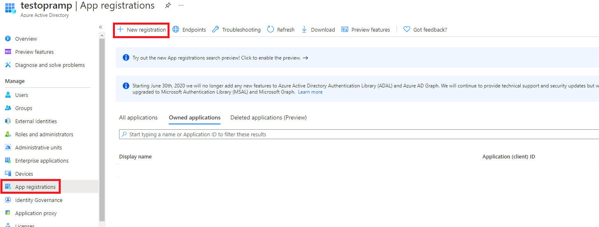
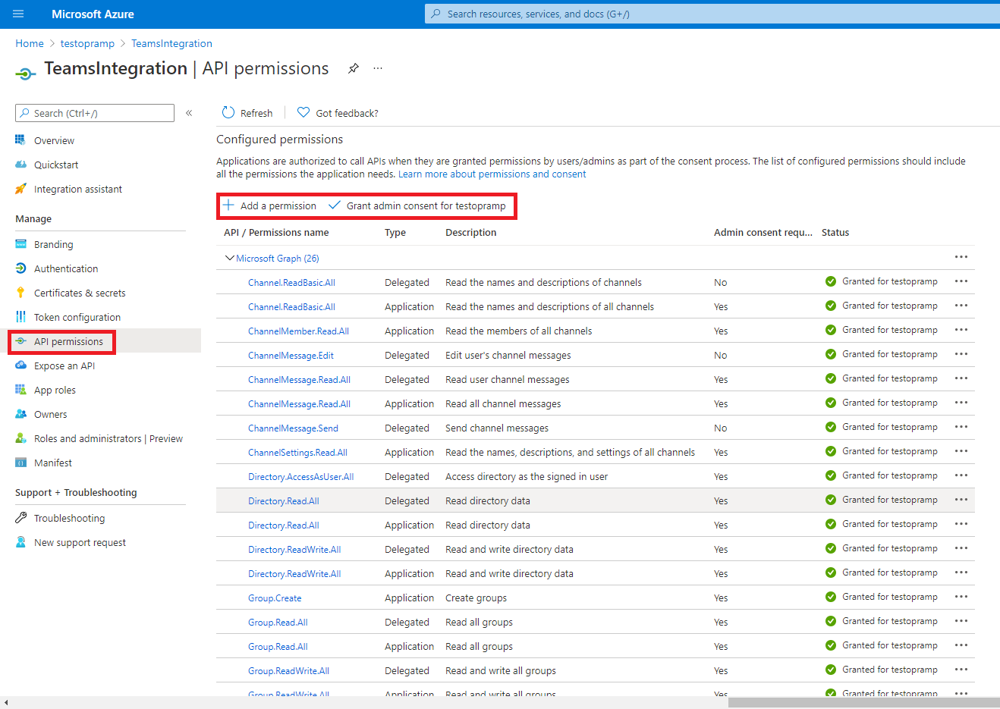
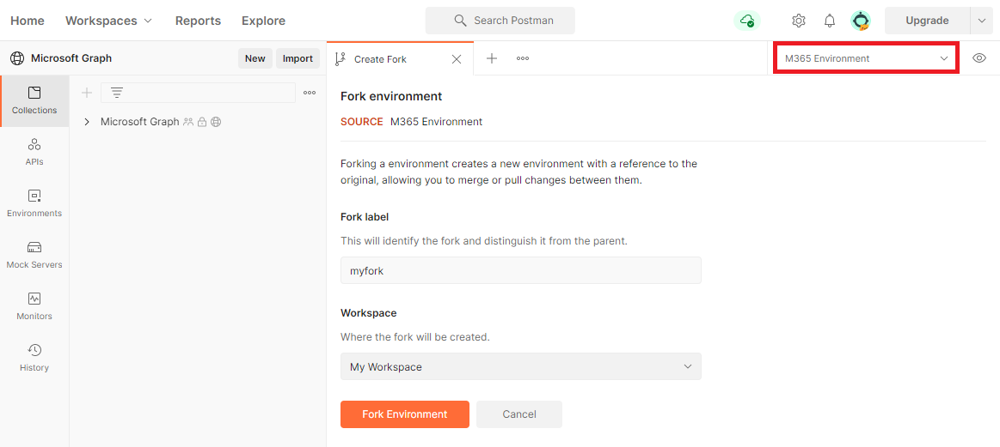
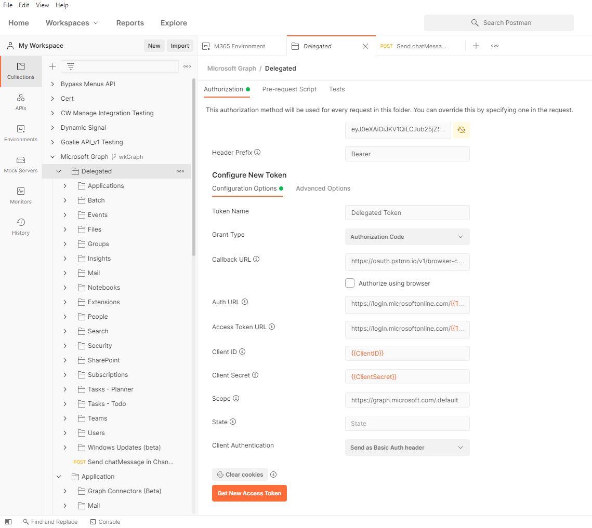
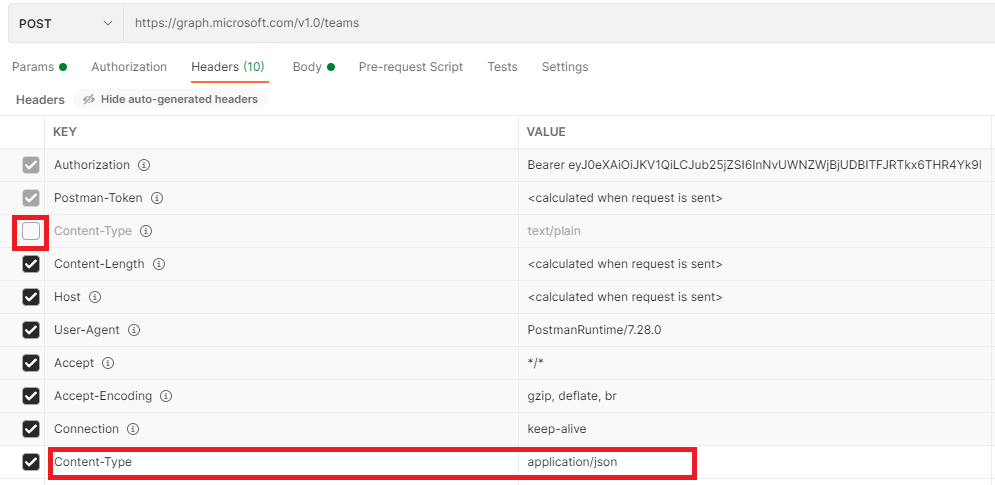
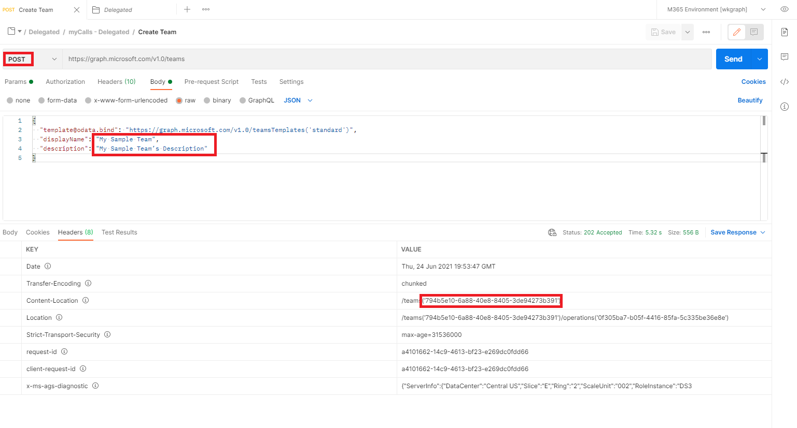
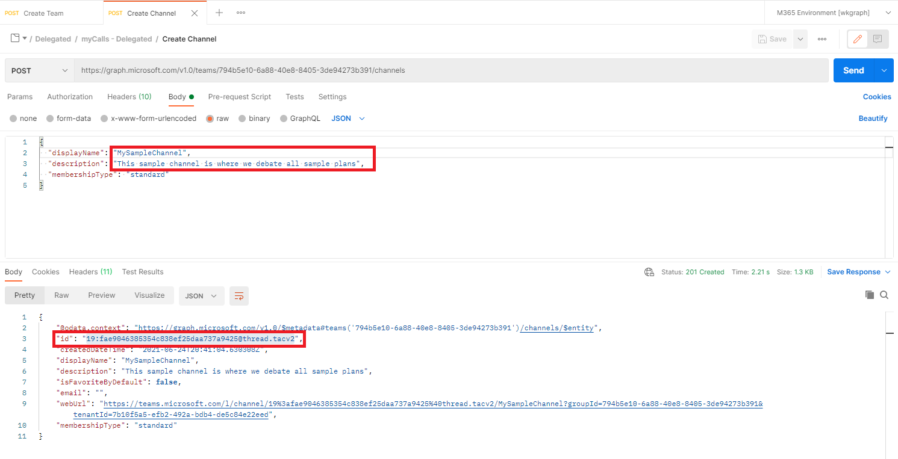
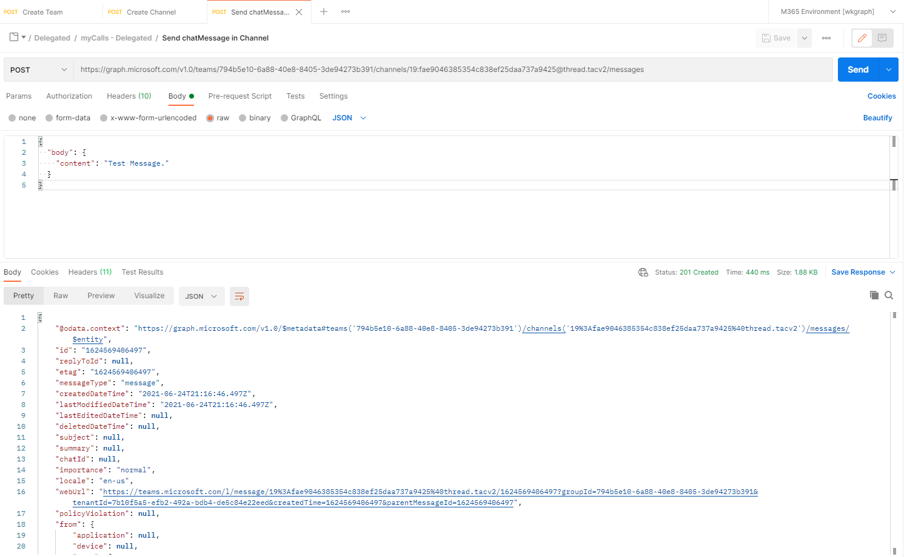
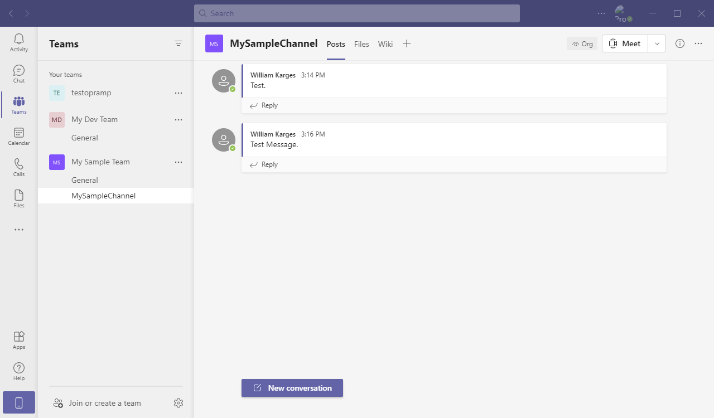

# Microsoft Teams Integration
Instructions to setup OpsRamp integration with Microsoft Teams.

## Prerequisites

* Must have (or know who has) administrative privileges within the Azure/O365 tenant associated with the desired Teams Environment.
    * *Must be using a Work or School O365 tenant, personal environments will not work.*
	* *If you just need an account for testing purposes, you can sign up [here](https://developer.microsoft.com/en-us/microsoft-365/dev-program).*

* Must obtain Azure admin credentials or setup an administrative service account and retain those credentials.
    * This user must have **Application administrator** and **Cloud application administrator** Administrative roles.

* Make sure you've signed into (and downloaded) the [Postman Desktop App](https://www.postman.com/).
    * *To expedite the setup, you can download this [Postman Collection](https://www.getpostman.com/collections/ab36bd02b4dfe7897f52).*

## Step 1 - Create an Azure AD Application

1. Go to [portal.azure.com](https://portal.azure.com/) and sign in with your developer tenant administrator account.
2. Navigate to **Azure Active Directory**.
3. On the left menu, click **App registrations**, the click **New registration**.

4. Set the **Application name** to `Teams Integration` or something similar.
5. Set the **Redirect URI** to `https://oauth.pstmn.io/v1/browser-callback` and click **Register**.
6. In the left menu, click **API Permissions**.
7. Click **Add a permission**, select **Microsoft Graph**, then add permissions from the following table.
    * *Note: I have not yet identified the minimum privileges required, this is simply the list I used to get the integration working*
	
| Type        | Permissions Name  |
| ------------- | ------------- |
| Delegated | ChannelMessage.Edit |
| Application | ChannelMember.Read.All |
| Both | Channel.ReadBasic.All |
| Both | ChannelMessage.Read.All |
| Delegated | ChannelMessage.Send |
| Application | ChannelSettings.Read.All |
| Delegated | Directory.AccessAsUser.All |
| Both | Directory.Read.All |
| Both | Directory.ReadWrite.All |
| Application | Group.Create |
| Both | Group.Read.All |
| Both | Group.ReadWrite.All |
| Both | GroupMember.Read.All |
| Application | GroupMember.ReadWrite.All |
| Both | TeamMember.Read.All |
| Application | Teamwork.Migrate.All |
| Delegated | User.Read |
| Application | User.Read.All |



8. Click **Grant admin consent for** and click **Yes**
    * *Note: If you are not logged in as an administrator you will need an Admin to login and grant consent.*
9. In the left menu click **Overview**.  Here you can obtain your **Application (client)** and **Directory (tenant) IDs**.  Copy them down and store them somewhere secure, you will need them in the next section.
10. In the left menu, click **Certificates & Secrets**.  Click **New client secret**, enter a description, and click **Add**.  Again copy and securely store your **client secret**, you will need it in the next section.

## Step 2 - Authenticate through Postman

1. Fork the Postman collection labeled [Microsoft Graph](https://www.postman.com/microsoftgraph/workspace/microsoft-graph/environment/455214-efbc69b2-69bd-402e-9e72-850b3a49bb21/fork).
1. Give your fork a unique label, this can be anything you want.
1. **IMPORTANT** - Make sure you select **M365 Environment** in the top-right environment drop-down, not **No environment**.
1. Click **Fork Environment**

1. In `ClientID`, set the **current value** to the **application (client) ID** from step 1.9.
1. In `TenantID`, set the **current value** to the **directory (tenant) ID** from step 1.9.
1. In `ClientSecret`, set the **current value** to the **client secret** value from step 1.10.
1. Click **Save**.

## Step 3 - Obtaining your Access Token

1. Right click the **Delegated** folder and select **Edit**
1. Click the **Authorization** tab.
    * Assuming you've correctly entered your credentials in the previous section, the default settings should all work.

1. Scroll down and click, **Get New Access Token**.
1. An O365 login pop-up should appear, sign in with your developer tenant administrator account.
1. Click **Proceed**, and then click the **Use Token** button.
1. On the bottom right of the dialog, click **Update**.

## Step 4 - Obtaining the necessary request parameters through Postman.

  In order to make posts to Microsoft Teams you'll need a Team Channel to post to.  In this tutorial we're going to create a new team and channel but you can alternatively use an existing [Team](https://docs.microsoft.com/en-us/graph/teams-list-all-teams?context=graph%2Fapi%2F1.0&view=graph-rest-1.0) & [Channel](https://docs.microsoft.com/en-us/graph/api/channel-list?view=graph-rest-1.0&tabs=http).

### Create new Team

1. Right click the **Delegated** folder and add a new folder, you can name it whatever you like.
2. Right click on your folder and add a new `POST` request called **Create Team**.
    * **Make sure you change the request type to `POST`**
	* Set the URL to `https://graph.microsoft.com/v1.0/teams`
	* Deactivate the default `Content-Type` header and add a new one with `application/json` as the value.
	    * `| Content-Type | application/json |`
	
	* Update the request Body to:
	```
	{
	  "template@odata.bind": "https://graph.microsoft.com/v1.0/teamsTemplates('standard')",
	  "displayName": "<yourTeamName>",
	  "description": "<yourTeamDescription>"
	}
	```
	    * Make sure you update the Team name and Description with your desired values.
3. **Send** the request and you should get a **202 Accepted** response status.
4. Navigate to the response Headers and you should see a `Content-Location` header.  That header will contain your **TeamID**, make sure you copy this down and save it for later.
    * Example: `| Content-Location | /teams('794b5e10-6a88-40e8-8405-3de94273b391') |`



### Create a new Channel

1. Right click on your folder again and create another new `POST` request called **Create Channel**
    * Again, make sure you change the type to `POST`.
	* Set the URL to `https://graph.microsoft.com/v1.0/teams/{team-id}/channels` and update the `team-id` with the value from your previous call.
	    * You can alternatively set `{{team-id}}` as a variable and add the value to the M365 environment.
	* Again, change the `Content-Type` header to `application/json`.
	* Update the request Body:
	```
	{
	  "displayName": "<yourChannelName>",
	  "description": "<yourChannelDescription>",
	  "membershipType": "standard"
	}
	```
	* Make sure you update the **displayName** and **description** then **Send** the request.
	   * You should get a **201 Created** Response status.
2. In the response body you should see your **channel id**, make sure you copy this down for later use.



3. In your Microsoft Teams environment you should see the Team and Channel you've created.  You are now ready to message Teams.

## Step 5 - Send chatMessage to Teams

1. Create a new Request in your folder titled **Send chatMessage in Channel**
2. Set the URL to `https://graph.microsoft.com/v1.0/teams/{team-id}/channels/{channel-id}/messages`
    * Update the `team-id` and `channel-id` with the relevant values from your previous two requests.
3. Change the `Content-Type` header to `application/json`.
4. Update the request Body:

```
{
  "body": {
    "content": "Test Message."
  }
}
```

    * You don't need to update the content, we're just testing to ensure the integration works.
5. **Send** the request and you should get a **201 Created** response code.
    * Open your Teams application and verify the messages have been sent.

#### Send chatMessage Request


#### Validation


Assuming your messages are posting correctly we're now ready to bring the integration into OpsRamp!

## Step 6 - Integrating Teams with OpsRamp

### Prerequisites

In order to establish the integration between OpsRamp and Microsoft Teams, ensure you have the following items:
 * **clientID** (from step 1.9).
 * **clientSecret** (from step 1.10).
 * **Azure Admin/Service Account Credentials** (username/password)
 * **TeamID/ChannelID** (from Section 4).
 
### Integration Setup
 
1. Within the OpsRamp Console go to **Setup** > **Integrations** > **Other** > **Custom Integration**
    * Name the integration **Microsoft Teams**
	* Optionally enter a description.
	* Set the Category to **Collaboration** and the Direction to **Outbound**.
	* Optionally add the [Microsoft Teams Logo](https://client-shared.s3.us-west-2.amazonaws.com/misc/logos/Microsoft_Office_Teams_(2018%E2%80%93present).svg.png).
2. Update the **Integration Basic Configuration**:
    * Change the Notification Type to **REST API**
	* Change the Authorization Type to **OAUTH2**
	* Change the Grant Type to **Password Credentials**
3. Update the remaining fields:

| Field | Value |
| ----- | ----- |
| Base URI | https://graph.microsoft.com/v1.0 |
| Key | `<yourClientID>` |
| Secret | `<yourClientSecret>` |
| User Name | `<AzureUsername>` |
| Password | `<AzurePassword>` |
| Access Token URL | `https://login.microsoftonline.com/<tenantID>/oauth2/v2.0/token` |
| Scope | `https://graph.microsoft.com/.default` |

4. Add a new **Integration Event** and update the following fields:

| Field | Value |
| ----- | ----- |
| Name | Teams sendChat |
| End Point URL | `https://graph.microsoft.com/v1.0/teams/<your-team-id>/channels/<your-channel-id>/messages` |
| Web Method | Post |
| Headers | *See Below* |
| `Content-Type` | `application/json` |
| `Connection` | `keep-alive` |

5. It's up to you to customize the `On` conditions for sending the message, as well as the message `Payload`.
6. Verify the Integration.
    * Select your integration event and set the payload type as JSON.
	* Put in a test JSON and verify your message is sent.
	```
	{
	  "body": {
		"content": "OpsRamp Test Message."
	  }
	}
	```
	* And you're finished!  From there you can fine tune the notification conditions and payload at your discretion.

## Reference Documentation

* [Microsoft Graph in Postman](https://docs.microsoft.com/en-us/graph/use-postman).
* [Send chatMessage in Teams Channel](https://docs.microsoft.com/en-us/graph/api/channel-post-messages?view=graph-rest-1.0&tabs=http).
* [Custom Integrations in OpsRamp](https://docs.opsramp.com/integrations/a2r/custom-integration/custom-integration/).